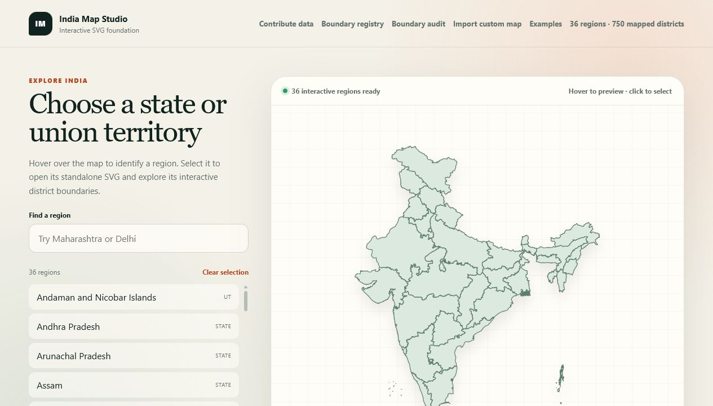
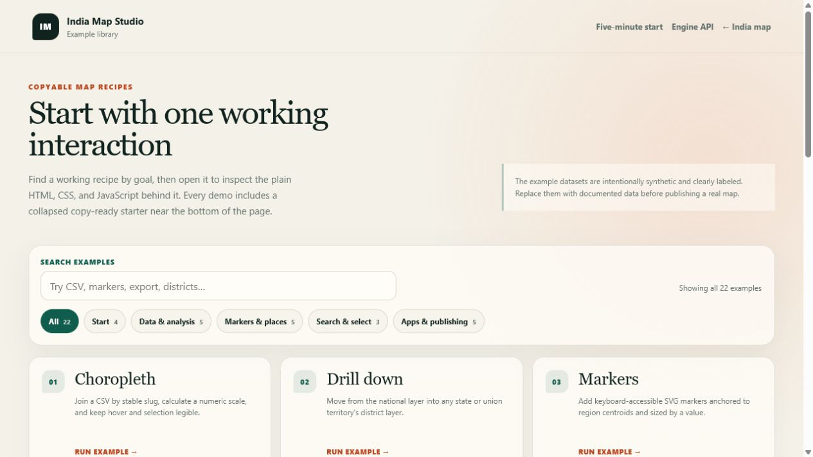

<div align="center">

# India Map Studio

### Build interactive maps of India with plain HTML, CSS, JavaScript, and SVG.

[](https://github.com/nikhilsawantse/india-map-studio/actions/workflows/browser-quality.yml)
[](LICENSE)
[](docs/api-stability.md)
[](#five-minute-start)

**[Open the live map](https://nikhilsawantse.github.io/india-map-studio/)** | **[Generate a starter](https://nikhilsawantse.github.io/india-map-studio/starter-generator.html)** | **[Browse examples](https://nikhilsawantse.github.io/india-map-studio/examples/)** | **[Start in five minutes](https://nikhilsawantse.github.io/india-map-studio/docs/quick-start.html)** | **[Use this template](https://github.com/nikhilsawantse/india-map-studio/generate)**

</div>

<a href="https://nikhilsawantse.github.io/india-map-studio/">
  
</a>

<p align="center"><sub>Search, hover, select, drill down, join data, annotate, tell stories, and export — directly in the browser.</sub></p>

| **36** regions | **750** district features | **22** focused demos | **0** framework dependencies |
|:--:|:--:|:--:|:--:|
| States and union territories | Across public SVG layers | Each with copy-ready code | No build step required |

## See what you can build

Every demo is runnable, searchable, and includes a collapsed recipe that can be copied into another project.

<a href="https://nikhilsawantse.github.io/india-map-studio/examples/">
  
</a>

| Goal | Try it | What it demonstrates |
| --- | --- | --- |
| Visualize regional data | [Choropleth](https://nikhilsawantse.github.io/india-map-studio/examples/choropleth.html) | CSV joins, color scales, legends, and selection |
| Navigate into districts | [Drill down](https://nikhilsawantse.github.io/india-map-studio/examples/drill-down.html) | National-to-district navigation with stable slugs |
| Show useful places | [POI layers](https://nikhilsawantse.github.io/india-map-studio/examples/poi-layers.html) | Reservoirs, sanctuaries, stations, search, and sourced markers |
| Compare performance | [Ranking dashboard](https://nikhilsawantse.github.io/india-map-studio/examples/ranking-dashboard.html) | Synchronized map, ranking list, filters, and statistics |
| Let users add information | [Editable annotations](https://nikhilsawantse.github.io/india-map-studio/examples/editable-annotations.html) | Markers, notes, categories, local saving, JSON import/export |
| Present a geographic story | [Story map](https://nikhilsawantse.github.io/india-map-studio/examples/story-map.html) | Guided chapters, highlights, descriptions, and images |
| Produce a report | [Printable map](https://nikhilsawantse.github.io/india-map-studio/examples/printable-report.html) | Print layout, title, legend, notes, SVG, and PNG export |
| Publish an interactive map | [Embeddable map](https://nikhilsawantse.github.io/india-map-studio/examples/embedded-map.html) | Reusable iframe and JavaScript integration |

**[Explore all 22 examples →](https://nikhilsawantse.github.io/india-map-studio/examples/)**

## Why India Map Studio?

| Start quickly | Build real workflows | Keep control |
| --- | --- | --- |
| Plain browser technologies and an editable starter | CSV/JSON data, filters, markers, comparisons, stories, reports, and export | No framework lock-in, no required build pipeline, and stable Version 1 contracts |
| Copy-ready recipes in every demo | 36 state/UT layers and 750 district features | Reusable SVG assets, documented identifiers, and source metadata |
| Keyboard, touch, narrow-screen, and accessibility coverage | Custom SVG/GeoJSON import and standalone HTML export | MIT application code with explicit third-party data notices |

## Five-minute start

Prefer a guided setup? The [project starter generator](https://nikhilsawantse.github.io/india-map-studio/starter-generator.html)
lets you choose a layer, use-case preset, colors, and CSV data while previewing
the result, then copies or downloads a complete standalone HTML file.

SVG files are fetched by the browser, so serve the folder over HTTP:

```powershell
git clone https://github.com/nikhilsawantse/india-map-studio.git
cd india-map-studio
python -m http.server 8000
```

Open `http://localhost:8000/starter/`, then edit:

- `starter/index.html` for structure
- `starter/styles.css` for appearance
- `starter/app.js` for behavior and data

Or embed the reusable Web Component:

```html
<india-svg-map
  src="assets/maps/india-states.svg"
  selected="maharashtra"
></india-svg-map>

<script src="map-engine.js"></script>
<script src="india-svg-map.js"></script>
```

For full control, use the documented [`IndiaMapEngine`](docs/map-engine.md) JavaScript API.

## Feature highlights

- Interactive national, state/UT, district, and registered deeper-boundary workspaces
- Search, hover, keyboard focus, selection, tooltips, profiles, and breadcrumbs
- Zoom, wheel navigation, drag-to-pan, automatic focus, and reset controls
- Division/group filters, labels, stable identifiers, Census codes, and LGD codes
- CSV/JSON imports with automatic matching, numeric/categorical styling, and legends
- Data rules, list/map filters, comparisons, editable fields, and click actions
- Markers, clustering, heatmaps, POI layers, nearby search, routes, and time series
- User annotations, story maps, rankings, printable reports, and PIN-code exploration
- Project snapshots, undo/redo, JSON portability, iframe snippets, and standalone export
- SVG, PNG, identified-SVG, and high-resolution map exports
- Custom SVG/GeoJSON import with sanitization, identifiers, and contribution validation
- Responsive mobile workspaces, keyboard navigation, announcements, and reduced motion

<details>
<summary><strong>Administrative coverage and deeper navigation</strong></summary>

- Separate SVG files for all 36 states and union territories
- 750 interactive district features across current and source-vintage layers
- Maharashtra and Karnataka administrative-division filters
- District-first controls for layers without configured intermediate groupings
- Dedicated district pages and stable child-layer identifiers
- Pune pilot with 14 tehsil/taluka boundaries and administrative codes
- Reusable tehsil workspace for compatible block, village, panchayat, ward, or local-area layers
- Release-safe outline fallbacks when deeper redistribution-safe geometry is unavailable
- Nationwide audit against current Local Government Directory district counts

</details>

<details>
<summary><strong>Data, authoring, and publishing tools</strong></summary>

- Session CSV/JSON imports and in-browser district data editing
- Numeric and categorical choropleths with legends and filtering
- Configurable tooltip and popup fields with text, links, and images
- Four-region comparison mode with shareable URLs
- Layer manager and live style editor
- Thirty-step undo/redo history
- Browser snapshots plus portable project JSON
- Single-file interactive HTML, iframe, SVG, and PNG export
- Boundary contribution wizard for SVG/GeoJSON geometry, provenance, rights, and identifiers

</details>

## Stable API and identifiers

Version 1 freezes the public runtime, Web Component, event, boundary-registry, and contribution-manifest contracts. Use documented slugs and feature IDs for application joins; administrative codes remain separate metadata.

```text
Region:   IN-REGION-27
District: IN-REGION-27-DISTRICT-521
Tehsil:   IN-REGION-27-DISTRICT-521-TEHSIL-04187
```

- [Version 1 stability contract](docs/api-stability.md)
- [Migration guide](MIGRATION.md)
- [Map engine API](docs/map-engine.md)
- [Boundary registry](data/boundary-registry.json)

## Documentation

| Get started | Build and publish | Project governance |
| --- | --- | --- |
| [Guided starter generator](starter-generator.html) | [Map engine API](docs/map-engine.md) | [Contributing](CONTRIBUTING.md) |
| [Five-minute quick start](docs/quick-start.md) | [Performance guide](docs/performance.md) | [Roadmap](ROADMAP.md) |
| [Minimal starter](starter/) | [Mobile UX contract](docs/mobile-ux.md) | [Security policy](SECURITY.md) |
| [Example library](examples/) | [Release notes](RELEASE_NOTES.md) | [Citation metadata](CITATION.cff) |
| [Version 1 migration](MIGRATION.md) | [Release process](RELEASE_PROCESS.md) | [Data licences](DATA_LICENSES.md) |
| [Boundary registry](data/boundary-registry.json) | [API stability](docs/api-stability.md) | [Code of conduct](CODE_OF_CONDUCT.md) |

## Project layout

```text
index.html                    National explorer
state.html / district.html    Administrative drill-down workspaces
map-engine.js                 Reusable framework-free runtime
india-svg-map.js              Reusable Web Component
assets/maps/                  National, state, district, and deeper SVG layers
data/                         Registries, profiles, indexes, and schemas
examples/                     Runnable recipes with copy-ready snippets
sample-data/                  Synthetic CSV and JSON examples
starter/                      Minimal editable application
docs/                         User and API documentation
tests/                        Browser, accessibility, contract, and performance tests
tools/                        Validation, generation, and release utilities
```

## Quality checks

```powershell
python -m unittest discover -s tests -v
python tools/check_public_release.py
pnpm test:browser
pnpm test:performance
```

The automated suite covers core navigation, public APIs, example recipes, mobile layouts, serious accessibility violations, schema compatibility, public data safety, and performance budgets.

## Contributing

Contributions are welcome — especially documented boundary sources, accessibility improvements, examples, tests, and clear issue reports.

1. Read [`CONTRIBUTING.md`](CONTRIBUTING.md).
2. For boundary data, follow the [boundary contribution guide](docs/contributing-boundaries.md).
3. Run the relevant checks before opening a pull request.

The repository includes issue templates, a pull-request template, contribution validation, and a code of conduct.

## Data and licensing

Application code is available under the [MIT License](LICENSE). Third-party geographic data keeps its original terms. Public releases exclude local Survey of India-derived prototypes without confirmed redistribution rights.

Before redistributing boundary assets, review:

- [Data licence inventory](DATA_LICENSES.md)
- [Detailed attribution](ATTRIBUTION.md)
- [Third-party notices](THIRD_PARTY_NOTICES.md)

Boundary data is provided for visualization and prototyping, not legal boundary determination.

## Citation

Research and published projects can use the repository's [`CITATION.cff`](CITATION.cff) metadata.

---

<div align="center">

Built as an open, framework-free foundation for useful India-focused map experiences.

**[Try India Map Studio](https://nikhilsawantse.github.io/india-map-studio/)**

</div>
